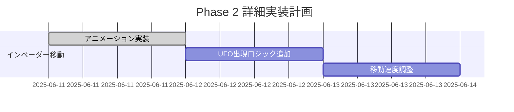
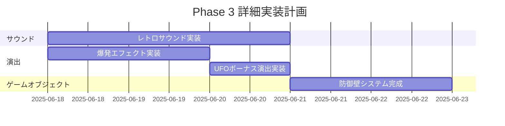
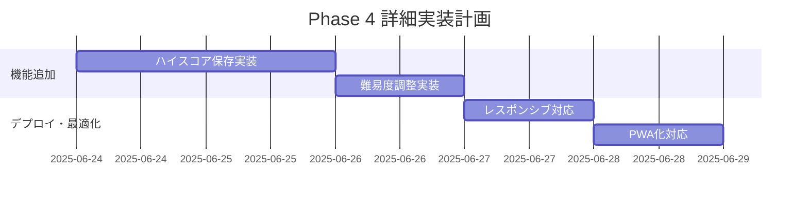

# OpenCode Memory

# スペースインベーダー再現プロジェクト

## プロジェクト概要
1978年にタイトーから発売された伝説的なアーケードゲーム「スペースインベーダー」を現代の技術で忠実に再現します。オリジナルの魅力を保ちつつ、モダンなコードベースで実装することを目指します。

## ゲーム仕様（オリジナル準拠）

### 基本ゲームプレイ
- **プレイヤー**: 画面下部の大砲（戦車）を左右に移動
- **敵**: 5行×11列（計55体）のインベーダーが上から侵攻
- **目的**: 全てのインベーダーを撃破する
- **ゲームオーバー**: インベーダーが地面に到達、またはプレイヤーの残機が0

### インベーダーの動作パターン
```
- 横に一定距離移動後、下に1段下降して逆方向に移動
- 残り数が少なくなるほど移動速度が上昇
- 最下段のインベーダーのみが弾を発射可能
- 各列の最下段が撃破されると、その上のインベーダーが弾を撃つ
```

### スコアシステム
- **上段インベーダー（小）**: 30点
- **中段インベーダー（中）**: 20点  
- **下段インベーダー（大）**: 10点
- **UFO（ボーナス）**: 50-300点（ランダム）
- **残機ボーナス**: 1500点、以降7500点ごと

### 技術的特徴（オリジナル再現）
- **解像度**: 224×256ピクセル（縦画面）
- **フレームレート**: 60FPS
- **色**: モノクロ + カラーオーバーレイ
- **サウンド**: シンプルなビープ音4種類

## 技術スタック

### フロントエンド
- **言語**: TypeScript
- **フレームワーク**: HTML5 Canvas + Vanilla JS（ライブラリ依存最小限）
- **ビルドツール**: Vite
- **スタイル**: CSS3（最小限）

### オーディオ
- **Web Audio API**: レトロサウンド生成
- **AudioContext**: リアルタイム音声合成

### デプロイ
- **静的サイト**: GitHub Pages / Netlify
- **PWA対応**: オフラインプレイ可能

## プロジェクト構造
```
src/
├── game/
│   ├── Game.ts              # メインゲームクラス
│   ├── Player.ts            # プレイヤー（大砲）
│   ├── Invader.ts           # インベーダークラス
│   ├── InvaderGrid.ts       # インベーダー編隊管理
│   ├── Bullet.ts            # 弾丸クラス
│   ├── UFO.ts               # ボーナスUFO
│   ├── Barrier.ts           # 防御壁
│   └── Explosion.ts         # 爆発エフェクト
├── audio/
│   ├── SoundEngine.ts       # サウンド管理
│   └── sounds/              # 音声ファイル
├── graphics/
│   ├── Renderer.ts          # 描画エンジン
│   ├── Sprite.ts            # スプライト管理
│   └── sprites/             # スプライト画像
├── input/
│   ├── InputManager.ts      # 入力処理
│   └── Controls.ts          # キー設定
├── utils/
│   ├── Vector2.ts           # 2Dベクトル
│   ├── Timer.ts             # タイマー
│   └── Constants.ts         # ゲーム定数
└── main.ts                  # エントリーポイント
```

## 開発ガイドライン

### レトロゲーム再現の重要ポイント

#### 1. ピクセルパーフェクト描画
```typescript
// 良い例：整数座標での描画
class Sprite {
  render(x: number, y: number) {
    const pixelX = Math.floor(x);
    const pixelY = Math.floor(y);
    ctx.drawImage(this.image, pixelX, pixelY);
  }
}

// 悪い例：浮動小数点座標（ぼやける）
ctx.drawImage(sprite, x + 0.5, y + 0.3);
```

#### 2. 固定フレームレート
```typescript
class GameLoop {
  private lastTime = 0;
  private readonly TARGET_FPS = 60;
  private readonly FRAME_TIME = 1000 / this.TARGET_FPS;

  update(currentTime: number) {
    if (currentTime - this.lastTime >= this.FRAME_TIME) {
      this.gameUpdate();
      this.render();
      this.lastTime = currentTime;
    }
  }
}
```

#### 3. オリジナルの音響効果
```typescript
class RetroSounds {
  // 射撃音（短いビープ）
  playShoot() {
    const oscillator = this.audioContext.createOscillator();
    oscillator.frequency.setValueAtTime(800, 0);
    oscillator.frequency.exponentialRampToValueAtTime(400, 0.1);
    // ...
  }

  // インベーダー移動音（4段階の低音）
  playInvaderMove(step: number) {
    const frequencies = [120, 100, 80, 60];
    // ...
  }
}
```

### コーディング規約

#### クラス設計
```typescript
// ゲームオブジェクトの基底クラス
abstract class GameObject {
  protected position: Vector2;
  protected velocity: Vector2;
  protected alive: boolean = true;

  abstract update(deltaTime: number): void;
  abstract render(renderer: Renderer): void;
  abstract getBounds(): Rectangle;
}

// インベーダー実装例
class Invader extends GameObject {
  constructor(
    private type: InvaderType,
    position: Vector2
  ) {
    super();
    this.position = position;
  }

  update(deltaTime: number): void {
    // オリジナルの移動パターン実装
  }
}
```

#### 状態管理
```typescript
enum GameState {
  MENU,
  PLAYING,
  GAME_OVER,
  PAUSED
}

class GameStateManager {
  private currentState: GameState = GameState.MENU;
  
  setState(newState: GameState): void {
    this.currentState = newState;
    this.onStateChange(newState);
  }
}
```

## オリジナル仕様の詳細実装

### インベーダーの移動アルゴリズム
```typescript
class InvaderGrid {
  private direction: number = 1; // 1: 右, -1: 左
  private moveDistance: number = 12; // ピクセル
  private dropDistance: number = 16; // ピクセル

  update(): void {
    // 端に到達チェック
    if (this.shouldChangeDirection()) {
      this.dropDown();
      this.direction *= -1;
    } else {
      this.moveHorizontally();
    }
  }
}
```

### 防御壁の破壊システム
```typescript
class Barrier {
  private pixels: boolean[][]; // ピクセル単位の破壊管理
  
  takeDamage(x: number, y: number): void {
    // 爆発範囲のピクセルを削除
    for (let dx = -2; dx <= 2; dx++) {
      for (let dy = -2; dy <= 2; dy++) {
        this.pixels[y + dy]?.[x + dx] = false;
      }
    }
  }
}
```

### スコア表示システム
```typescript
class ScoreDisplay {
  private score: number = 0;
  private hiScore: number = 0;

  // オリジナルのフォントスタイル再現
  renderScore(renderer: Renderer): void {
    renderer.drawBitmapText(`SCORE<1>`, 50, 20);
    renderer.drawBitmapText(this.score.toString().padStart(4, '0'), 50, 40);
    renderer.drawBitmapText(`HI-SCORE`, 150, 20);
    renderer.drawBitmapText(this.hiScore.toString().padStart(4, '0'), 150, 40);
  }
}
```

## 開発段階

### Phase 1: 基本システム（完了目標：2週間）
- [x] Canvas setup とゲームループ
- [x] プレイヤー移動と射撃
- [x] 当たり判定システム

### Phase 2: ゲームロジック（完了目標：3週間） - 完了
- [x] インベーダー移動パターン (基本実装完了)
- [x] インベーダー移動パターン調整 (アニメーション実装完了)
- [x] インベーダー移動パターン調整 (UFO出現ロジック実装完了)
- [x] インベーダー移動パターン調整 (移動速度調整完了)
- [x] スコアシステム (基本実装)
- [x] スコア表示 (ビットマップフォント実装完了)
- [x] スコアシステム (種類別得点設定完了)
- [x] 残機システム (ライフ管理実装完了)
- [x] 残機システム (被弾処理実装完了)
- [x] 残機システム (残機表示UI実装完了)
- [x] ゲームオーバー処理 (敗北条件判定実装完了)
- [x] ゲームオーバー処理 (ゲームオーバー画面実装完了)
- [x] ゲームオーバー処理 (リスタート機能実装完了)

#### 実装計画


### Phase 3: 演出・サウンド（完了目標：2週間）
- [x] レトロサウンド実装完了
- [x] 爆発エフェクト実装完了
- [x] UFOボーナス実装完了
- [x] 防御壁システム

#### 実装計画


### Phase 4: 仕上げ（完了目標：1週間）
- [x] ハイスコア保存
- [x] 難易度調整
- [x] レスポンシブ対応
- [x] PWA化

#### 実装計画

    
    section スコアシステム
    ビットマップフォント表示 :2025-06-11, 2d
    種類別得点設定       :2025-06-13, 1d
    
    section 残機システム
    ライフ管理実装      :2025-06-12, 1d
    被弾処理実装        :2025-06-13, 1d
    残機表示UI         :2025-06-14, 1d
    
    section ゲームオーバー
    敗北条件判定実装    :2025-06-15, 1d
    ゲームオーバー画面   :2025-06-16, 1d
```

## パフォーマンス要件

### 目標仕様
- **フレームレート**: 安定60FPS
- **入力遅延**: 16ms以下
- **メモリ使用量**: 50MB以下
- **起動時間**: 3秒以下

### 最適化指針
```typescript
// オブジェクトプール使用例
class BulletPool {
  private pool: Bullet[] = [];
  
  getBullet(): Bullet {
    return this.pool.pop() || new Bullet();
  }
  
  returnBullet(bullet: Bullet): void {
    bullet.reset();
    this.pool.push(bullet);
  }
}
```

## 操作方法
- **移動**: ←→ キー または A/D キー
- **射撃**: スペースキー
- **ポーズ**: P キー
- **リスタート**: R キー

## Claude Codeへの指示

### 最優先事項
1. **オリジナル準拠**: 1978年版の動作を正確に再現
2. **パフォーマンス**: 60FPS を絶対に維持
3. **レトロ感**: ピクセルアート、ビープ音、モノクロ表示
4. **シンプルさ**: 複雑なフレームワークは使わない

### 実装時の注意点
- インベーダーの移動速度は残り数に反比例
- 音響効果は Web Audio API で生成（mp3ファイル不使用）
- スプライトは8x8、16x8ピクセルの制約を守る
- カラーオーバーレイで着色（緑、赤、白のエリア分け）

### 質問・相談が必要な場面
- オリジナルと異なる仕様の実装提案時
- パフォーマンス問題が発生した時
- ブラウザ互換性の問題が生じた時

### 参考資料
- [スペースインベーダー技術解説](https://www.computer-archeology.com/Arcade/SpaceInvaders/)
- [オリジナル基板仕様書](https://github.com/mamedev/mame/blob/master/src/mame/drivers/8080bw.cpp)
